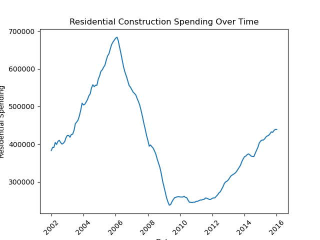
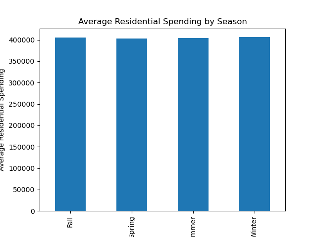
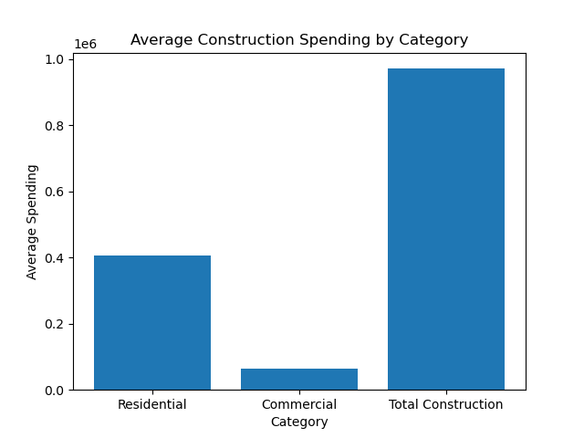
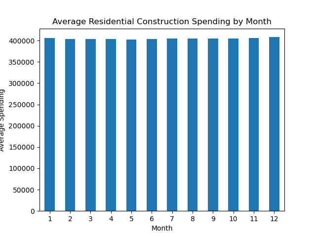

# Construction Spending: Does Season Matter?

Construction is something we see all the time, especially during warmer months. Most people assume that construction spending is higher in the summer and lower in the winter. I wanted to see if that is actually true using real data.

---

## 📈 Spending Over Time

This graph shows how construction spending changes over time. Overall, there is a spike in 2006 and after some research, it was due to the housing market greatly increasing, while after we see a heavy drop due to the housing market essentially crashing around 2010. After the insane spike and dropoff the graph shows how construction spending is slowly back to its orginal steady ground. There are some small drops and spikes as of recent, but nothing extreme. Slowly the spending has been increasing overtime. The increase could be due to population growth, more development, and higher costs.

## 📊 Average Spending by Month

This graph breaks spending down by each month. You might expect summer months like June and July to be the highest, but the data does not show a huge difference. Spending stays fairly consistent across all months. This suggests that construction projects happen year-round, not just in warm weather. Even though weather matters, companies still plan projects so work continues in all seasons.

## 📊 Spending by Category

This graph compares residential, commercial, and total construction spending. This was to see if the consienency in contruction spending throughout all the seasons was because of the type of constrcution being done. Residential spending is usually the highest, which means housing plays a big role in construction. Commercial spending is lower but still important. Total construction follows the same trend as residential, showing that housing drives most of the overall spending. This helps explain why the total does not change much by season.

## 📊 Residential Construction by Month

This graph shows the average residential construction spending for each month. At first, you might expect to see higher spending in the summer months, but the data does not show a strong seasonal pattern. The bars are very similar across all months, meaning spending stays fairly consistent throughout the year. This suggests that residential construction continues year-round even for something that is done more outside. This shows even during colder months it doesn't really matter what season it may be. This helps explain why earlier graphs did not show major seasonal differences in total construction spending.

## 🧠 Conclusion

At first, I thought construction spending would be much higher in the summer, but the data shows that it stays pretty consistent throughout the year. While weather might affect daily work, it does not drastically change total spending. Even specific type of construction doesn't have a drastic change. My theory is because a lot of states have nice weather year-round so this affects the data. While somehwhere like New York would have a drastic change in construction spending from the winter season and summer season. Construction is a year-round industry, and planning keeps projects moving even in colder months.

This was interesting because it challenged what I expected to see. It shows how important it is to look at real data instead of just guessing.